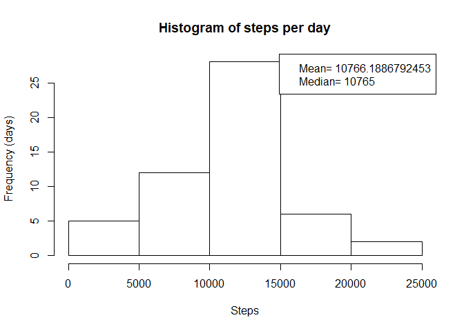

## Loading and preprocessing the data
Load the data from the compressed file

```r
data <- read.csv(unz("activity.zip", "activity.csv"))
```

## What is mean total number of steps taken per day?
First make a histogram of the steps per day. To do so, aggregate the data per day and then plot using the hist() function. The compute the mean and the median, add them to the plot in the legend.

```r
perDay<-aggregate(data$steps,list(data$date),sum, na.rm=TRUE, na.action=NULL)
hist(perDay$x[perDay$x>0],xlab="Steps",ylab="Frequency (days)",main="Histogram of steps per day")
# data for legend
meanSteps=mean(perDay$x[perDay$x>0])
medianSteps=median(perDay$x[perDay$x>0])
legend("topright",c(paste("Mean=",as.character(meanSteps)),paste("Median=",as.character(medianSteps) )) )
```

<!-- -->


## What is the average daily activity pattern?
Aggregate the data per time interval and then make a line plot to show the average pattern 

```r
perInt<-aggregate(data$steps,list(data$interval),mean, na.rm=TRUE, na.action=NULL)
plot(perInt$Group.1,perInt$x, type="l",xlab="Interval",ylab="Steps",main="Average daily activity pattern",col="red")
```

<!-- -->


## Imputing missing values
Calculate the number of columns with missing values

```r
nrow(data)-sum(complete.cases(data))
```

```
## [1] 2304
```
Fill-in the missing values with the average for the corresponding interval, create a new dataset

```r
# Average per interval
perInt<-aggregate(data$steps,list(data$interval),mean, na.rm=TRUE, na.action=NULL)
# Make a copy of original data 
fData<-data.frame(data)
# Fill missing (NA) values on the new dataframe using the average value
for (i in c(1:nrow(fData))){
  if(is.na(fData$steps[i])){
    fData$steps[i]<-perInt$x[perInt$Group.1==fData[i,"interval"]]
  }  
}
```
Re-compute the histogram of steps per day and re-calculate the media and the mean

```r
perDayF<-aggregate(fData$steps,list(fData$date),sum)
hist(perDayF$x,xlab="Steps",ylab="Frequency (days)",main="Histogram of steps per day")
meanSteps=mean(perDayF$x)
medianSteps=median(perDayF$x)
legend("topright",c(paste("Mean=",as.character(meanSteps)),paste("Median=",as.character(medianSteps) )) )
```

<!-- -->


## Are there differences in activity patterns between weekdays and weekends?
Create new variables with the day of the week for each date and assign the a factor for weekdays/weekends

```r
fData$day=weekdays(as.Date(fData$date))
fData$dayType<-sapply(fData$day,function(x){ if( x=="Saturday"|x=="Sunday" ) "weekend" else "weekday"})
```

Generate data of the average activity on weekdays and weekends

```r
# Subindex weekends and aggregate data
dataWeekend<-fData[fData$dayType=="weekend",]
intWeekend<-aggregate(dataWeekend$steps,list(dataWeekend$interval),mean)
# Subindex weekdays and aggregate data
dataWeekday<-fData[fData$dayType=="weekday",]
intWeekday<-aggregate(dataWeekday$steps,list(dataWeekday$interval),mean)
```

Plot the data in two panels

```r
par(mfrow=c(2,1))
plot(intWeekday$Group.1,intWeekday$x, type="l",xlab="Interval",ylab="Steps",main="Weekday",col="red")
plot(intWeekend$Group.1,intWeekend$x, type="l",xlab="Interval",ylab="Steps",main="Weekend",col="red")
```

<!-- -->
